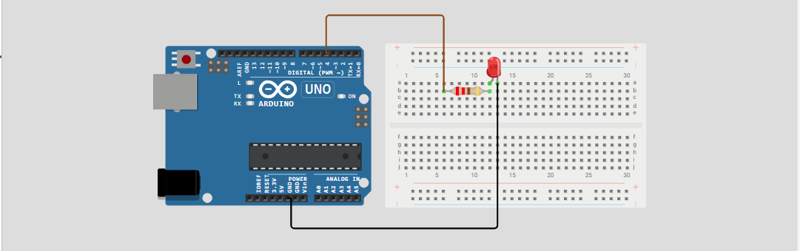

# Serial LED Control - Arduino Uno

This project allows controlling and LED via Serial Monitor.

## Components
- Arduino Uno
- LED
- Resistor (220 ohm)
- Jumper Wires
- Breadboard

## Wiring
- Connect LED Anode to the Arduino digital PIN (in this example PIN 4), through a Resistor (220 ohm Recommended).
- Connect LED Cathode to Ground PIN (labelled GND) on the Arduino.

