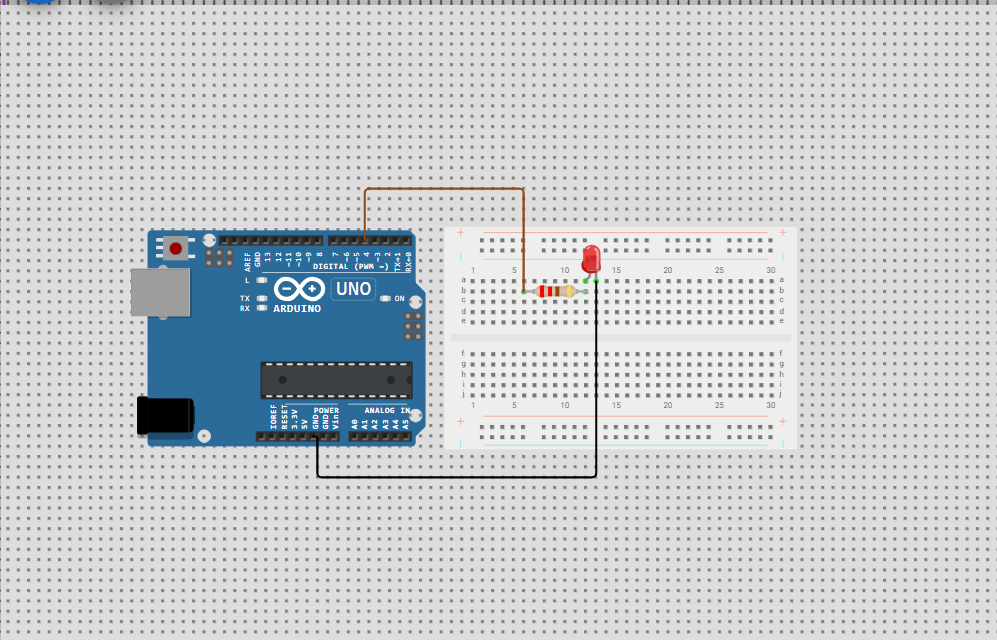

# Serial LED Control - Arduino Uno

This project allows controlling and LED via Serial Monitor.

## Components
- Arduino Uno
- LED
- Resistor (220 ohm)
- Jumper Wires
- Breadboard

## Wiring
- Connect LED Anode to Pin 4 (or anyother digital pin of your choice) on the Arduino.
- Connect LED Cathode to -> 220 ohm Resistor then to -> GND on the Arduino.

